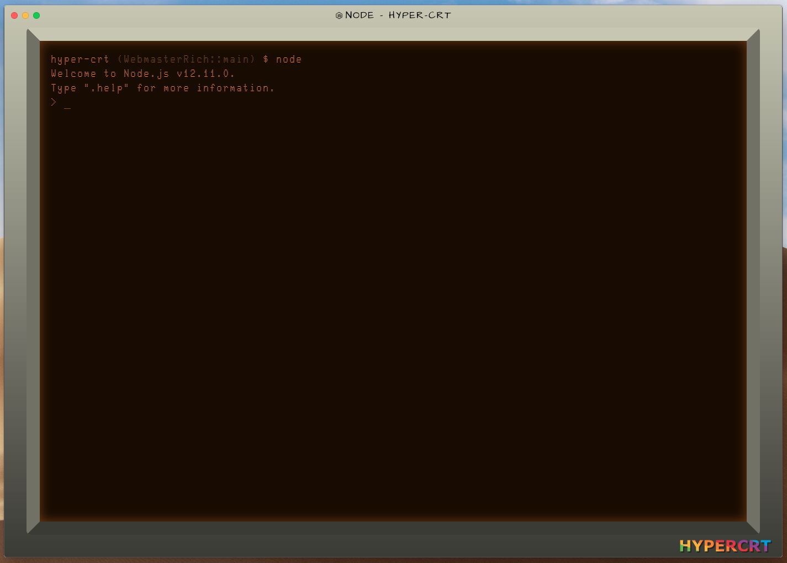
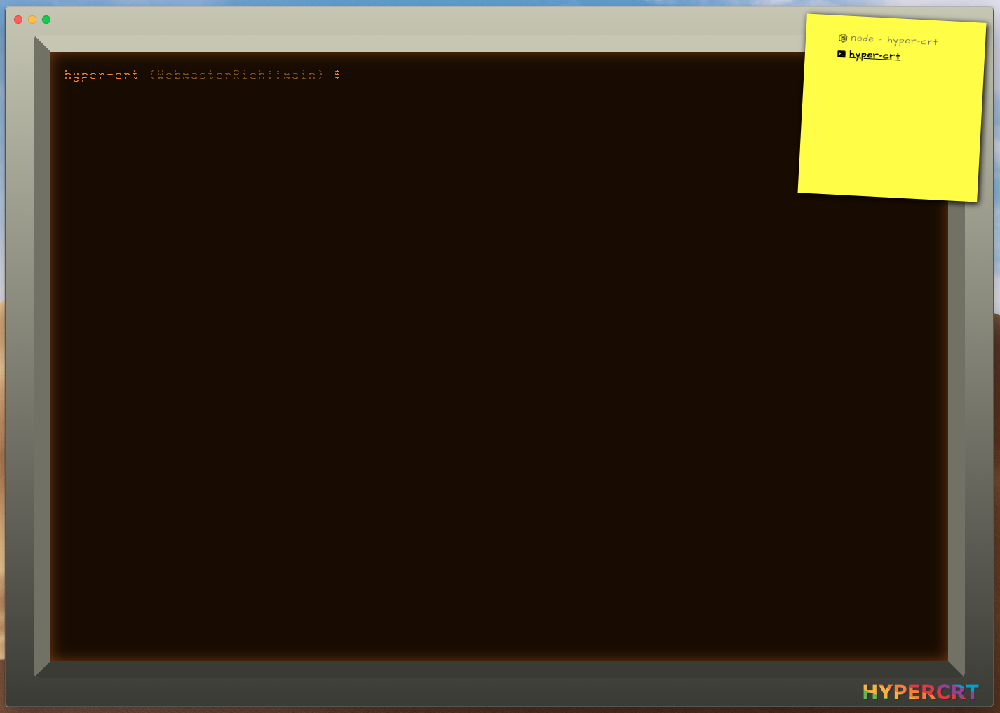

# Hyper CRT
Hyper theme designed to look and feel like an old school CRT. It is all done with CSS and configuration properties (no images) so it always looks like a monitor regardless of window size. That's right, you can make ridiculously wide or unbearably tall monitors if you want/need to.





## Install

```
plugins: [
  ...
  'hyper-crt'
  ...
]
```

## Fonts

It is suggested that you choose an old school terminal font and a hand-written UI font to get the full effect. The screenshots use [Glass TTY VT220](https://github.com/svofski/glasstty) for the terminal and [Architects Daughter](https://fonts.google.com/specimen/Architects+Daughter) for the UI. Font repositories like [Google Fonts](https://fonts.google.com/) and [dafont.com](https://www.dafont.com/) are excellent resources if you want to use other fonts.

> Note: The HYPERCRT logo is forced to a specific font so it always renders the same way.

## Third Party Integration

[Hyper Tab Icons (Plus)](https://github.com/sangdth/hyper-tab-icons-plus#configtabiconsdisablecolors) colors are disabled by the plugin to avoid color clashes in the UI.
